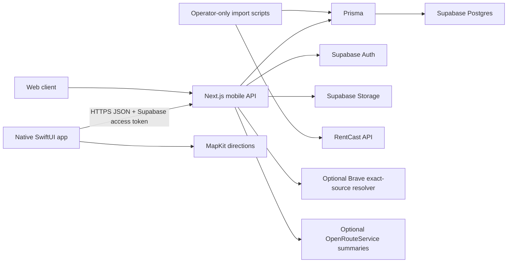

# Homeboard Project Report

**Audit date:** July 27, 2026
**Repository:** `/Users/samyanmangat/Documents/RealEstate`
**Product stage:** Functional native/web beta foundation with a blocked public listing-discovery pipeline

## 1. Executive Summary

Homeboard is intended to be a shared rental-search workspace for roommates. It is not supposed to be another listing portal, a generic AI chat product, or a scraper. Its differentiator is the group decision layer: every person can define an individual budget, commute destination, preferences, must-haves, and dealbreakers; the group can collect exact listing links, discuss them, compare commutes and affordability, vote, rate tradeoffs, and make decisions in one shared place.

The current repository contains far more than a prototype:

- A native SwiftUI iPhone application.
- A Next.js and TypeScript backend.
- Supabase authentication, Postgres persistence, and storage integration.
- Board creation, invitations, onboarding, memberships, updates, comments, ratings, reactions, decisions, and listing verification.
- Map and card discovery surfaces, group commute routing, affordability analysis, and source-trust logic.
- A controlled RentCast import process with a hard request ledger and transactional safety checks.
- A source-first listing system that rejects generic search links and same-building/wrong-unit matches.
- A partial image-upload pathway.

The most important current limitation is not simply that listing cards lack images. The database has 468 active RentCast candidates, but RentCast does not supply listing photos or exact public listing-page URLs. Homeboard intentionally prevents those candidates from appearing globally until an exact source URL is community-supported or verified. There are currently no catalog source records, so there are zero globally discoverable listings.

The image problem is therefore a chain of four unresolved problems:

1. **Identity:** Homeboard must prove that a source page and its images belong to the exact unit, not merely the same building.
2. **Rights:** Homeboard must have permission to copy, cache, transform, and display the images.
3. **Data access:** the current affordable provider does not return protected listing media, while MLS and portal APIs are licensed and difficult to obtain.
4. **Implementation:** the current import, mobile payload, and native UI all discard or fail to render listing photos.

The recommended near-term product is source-first rather than photo-first: show verified facts, map location, group fit, commute routes, and an exact source link; let users add exact links and private board media; do not scrape or hotlink portal images. A licensed MLS/provider feed can later add public listing photos when Homeboard has a contract that explicitly covers mobile display, storage, resizing, attribution, and retention.

## 2. What Homeboard Is Supposed to Become

### 2.1 Product purpose

Homeboard should solve the coordination failure that occurs when several people search for a rental together:

- Listing links are scattered across texts and group chats.
- Each roommate has a different budget and willingness to pay.
- Commute requirements point toward different neighborhoods.
- Must-haves and dealbreakers are remembered inconsistently.
- One person often performs most of the search work.
- Reactions such as “I like it” do not explain whether the objection is price, commute, room quality, neighborhood, or uncertainty.
- Decisions are lost when a listing is removed or its price changes.

The finished product should turn that process into a shared, auditable workspace rather than a single-user search result list.

### 2.2 Intended finished experience

1. A user creates an authenticated account.
2. The user completes concise onboarding that creates an individual `RentalProfile`.
3. The user creates a board or joins one through an invitation.
4. Every member adds their own:
   - Budget range and stretch budget.
   - Work, school, or commute destination.
   - Maximum acceptable commute.
   - Preferred neighborhoods.
   - Must-haves, nice-to-haves, and dealbreakers.
   - Priorities and readiness information.
5. Homeboard generates a transparent group brief that shows agreement and conflicts.
6. Members add exact listing links through the app, Safari, Zillow, StreetEasy, broker sites, or an iOS Share Extension.
7. Homeboard normalizes those links into one listing record when identity is exact.
8. The group sees:
   - Listing facts.
   - Exact source and trust state.
   - Affordability and possible rent splits.
   - Routes to each member’s commute destination.
   - Group ratings on relevant dimensions.
   - Comments, reactions, open questions, and decisions.
9. The board keeps history even if the public source is removed.
10. Optional cloud AI may later summarize tradeoffs or extract pasted listing text, but it should assist the board rather than become the product’s primary interface.

### 2.3 Product boundaries

Homeboard should not:

- Scrape Zillow, StreetEasy, or broker websites.
- Crawl listing portals.
- Pretend an address-search page is an exact listing source.
- Present same-building results as the requested unit.
- copy third-party listing photos without a license or valid user rights.
- Rank homes with an unexplained universal numeric AI score.
- Require a locally running language model on users’ phones.

## 3. Current Product Form

### 3.1 Native iPhone application

The primary product client is the SwiftUI project at:

`ios/HomeboardNative/HomeboardNative.xcodeproj`

The active native implementation includes:

- Account creation and sign-in through Supabase Auth.
- Board creation and invitation-code acceptance.
- Individual onboarding/profile editing.
- A three-tab workspace focused on Search, Shortlist, and Updates.
- Map and card views for listing inventory.
- Filters and an area-selection workflow.
- Individual and group affordability.
- Member commute anchors and MapKit route rendering.
- Board updates, shared messages, reactions, comments, ratings, and decisions.
- Exact listing-source submission and verification controls.
- A Share Extension foundation for sending a URL into Homeboard.
- Push-device token registration.

The two largest native files are:

- `ios/HomeboardNative/HomeboardNative/Sources/SharedWorkspaceView.swift`: approximately 5,100 lines.
- `ios/HomeboardNative/HomeboardNative/Sources/BoardShellView.swift`: approximately 3,800 lines.

This is functional breadth, but the file sizes make regressions, visual inconsistency, and state bugs more likely.

### 3.2 Next.js backend and web application

The backend is a Next.js 16 App Router project using TypeScript and React 19. It supplies:

- Web account, board, invitation, settings, and reset-password pages.
- Mobile session and account endpoints.
- Board, member, membership, message, update, listing, and invitation endpoints.
- Listing comments, ratings, reactions, reviews, decisions, source submissions, source resolution, attestations, reports, and admin review.
- Supabase Storage uploads.
- Push-token registration.
- Runtime-status and analytics export endpoints.

The web board remains in the repository, but the product direction is now native-first. Some older web chat/demo behavior and Ollama-oriented code still exists and contributes to product and maintenance ambiguity.

### 3.3 Data and authentication

The current production-shaped stack is:

- **Authentication:** Supabase Auth.
- **Primary database:** Supabase-hosted Postgres through Prisma.
- **File storage:** Supabase Storage.
- **Server:** Next.js.
- **Native networking:** `URLSession` through `HomeboardAPI.swift`.
- **Native maps/routes:** MapKit.
- **Optional server route estimates:** OpenRouteService.
- **Candidate listing data:** RentCast.
- **Optional exact-source search:** Brave Search.

No private key should be embedded in the iPhone app. Only the Supabase public URL and publishable key belong in the client. RentCast, Brave, database, Supabase service-role, and routing service secrets must remain server-side.

## 4. Current Architecture



### 4.1 Major backend modules

- `lib/board-data.ts`: board reads and mutations; approximately 3,200 lines.
- `lib/mobile-payloads.ts`: transforms database records into native payloads.
- `lib/rentcast-client.ts`: RentCast HTTP types and client.
- `lib/rentcast-import.ts`: validation, refresh, archival, and audit behavior.
- `lib/provider-request-budget.ts`: hard request reservation and usage ledger.
- `lib/listing-sources.ts`: URL canonicalization and exact listing identity.
- `lib/listing-source-policy.ts`: source trust-state derivation.
- `lib/catalog-listing-sources.ts`: submissions, attestations, reports, and promotion.
- `lib/listing-source-resolver.ts`: cached Brave exact-source resolution.
- `lib/listing-analysis.ts`: deterministic group tradeoff analysis.
- `lib/group-affordability.ts`: per-member budget and rent-allocation logic.
- `lib/commute-service.ts`: route-distance and travel-time summaries.
- `lib/mobile-auth.ts`: authenticated mobile request handling.

### 4.2 Major native modules

- `AppModel.swift`: authentication, board state, onboarding, listing actions, and networking coordination.
- `HomeboardAPI.swift`: backend request/response client.
- `HomeboardModels.swift`: native data models.
- `SharedWorkspaceView.swift`: active board/search/shortlist/update experience.
- `AccountOnboardingView.swift`: account and profile onboarding.
- `BoardShellView.swift`: older/parallel board surface still in the source tree.
- `HomeboardConfig.swift`: server and public web URL resolution.

## 5. Core Data Model

The Prisma schema contains the following major domains.

### 5.1 Identity and boards

- `User`
- `SearchBoard`
- `BoardMember`
- `BoardInvitation`
- `SearchProfile`
- `RoommateProfile`
- `ChatMessage`

### 5.2 Listings

- `Listing`
- `BoardListing`
- `PriceHistory`
- `BoardListingVerification`
- `BoardListingSource`
- `CatalogListingSource`
- `ListingSourceResolutionCache`

### 5.3 Source trust and evidence

- `CatalogSourceAttestation`
- `CatalogSourceReport`
- Source trust states:
  - `board_only`
  - `pending_review`
  - `community_supported`
  - `verified`
  - `review_hold`
  - `rejected`

### 5.4 Collaboration

- Listing votes and reactions.
- Comments.
- Per-member ratings.
- Reviews.
- Decisions and decision votes.
- Board events/activity.
- Push devices.
- Analytics events.

### 5.5 Provider operations

- `ProviderApiRequest` records external API reservations and outcomes.
- RentCast and Brave each have hard server-side budget enforcement.
- Request status checks do not consume provider requests.

## 6. Listing and Source Lifecycle

### 6.1 Candidate ingestion

RentCast supplies normalized facts for potential rentals:

- Address and unit.
- Price.
- Bedrooms and bathrooms.
- Square footage when available.
- Coordinates.
- Property type.
- Listing status and dates.
- Agent, office, MLS, and history metadata when available.

The import validates:

- Stable provider ID.
- Active status.
- Complete NYC address.
- Plausible monthly price.
- Valid bedrooms and bathrooms.
- NYC coordinates.
- Recent `lastSeenDate`.
- Unit identifier for apartments, condos, and multifamily rentals.
- Duplicate provider IDs and duplicate address/unit identities.

Rejected candidates are not proof that RentCast returned a “bad listing” in every case. They are records that failed Homeboard’s deliberately strict rules. For example, an otherwise legitimate apartment can be rejected because the provider omitted its unit number, making exact-source matching unsafe.

### 6.2 Exact source identity

Homeboard does not treat a Google, Zillow, StreetEasy, or generic web-search URL as a listing. An exact source must match:

- Normalized street address.
- Unit.
- Price, including accepted historical provider prices.
- Bedrooms.
- Bathrooms.

This is intentionally biased toward false negatives. It is better to hide a real candidate than attach the wrong apartment page and photos.

### 6.3 Board-local and global visibility

- A user-submitted exact link can be visible immediately on the submitting board.
- A source stays out of global discovery until community-supported or verified.
- Three independent board submissions can promote a source to `community_supported`.
- Five distinct authenticated users across at least three boards can promote it to `verified`.
- A credible wrong-unit, unavailable, or conflict report moves it to `review_hold`.
- Admin review can verify or reject it.

### 6.4 Current trust-policy inconsistency

There is one important code-level policy conflict:

- `lib/listing-source-policy.ts:25` treats `resolverExact` as immediately `verified`.
- `lib/listing-source-resolver.ts:183-207` writes Brave snippet matches directly as `verified`.

That behavior bypasses the otherwise careful community/admin model. A search snippet can be stale, truncated, or copied between sites. Resolver matches should normally become `pending_review`, not `verified`, until community or admin evidence confirms them.

## 7. Current Live Data Snapshot

A read-only audit of the configured database on July 27, 2026 found:

| Record | Count |
|---|---:|
| Users | 1 |
| Boards | 1 |
| Board members | 1 |
| Roommate profiles | 1 |
| Total listing rows | 879 |
| Active RentCast candidates | 468 |
| Archived/removed RentCast rows | 411 |
| Board listings | 0 |
| Catalog listing sources | 0 |
| Listings with a non-empty image field | 0 |
| Price-history rows | 500 |
| Invitations | 0 |
| Comments | 0 |
| Ratings | 0 |
| Source-resolution cache rows | 0 |
| Push devices | 0 |
| Analytics events | 1 |

All listing rows currently identify RentCast as their source.

The RentCast request ledger reported:

- Hard limit: 50 requests per 32-day window.
- Used: 2.
- Remaining: 48.
- Import configuration: ready.

The practical result is:

- Homeboard has 468 usable private candidate fact records.
- Homeboard has zero trusted exact source URLs.
- The mobile discovery endpoint correctly returns no global inventory.
- Homeboard has zero listing photos.

## 8. The Image Problem

### 8.1 The exact problem

Homeboard currently cannot show reliable apartment photos because it has neither a licensed media source nor an exact source URL for its imported candidates. Images cannot safely be attached by building address alone: New York buildings can have many simultaneous listings with similar bedroom counts and prices, and the wrong-unit error is precisely the failure the source-trust system was created to prevent.

A listing image is not merely decoration. It is evidence about a specific unit. If Homeboard displays a photo from apartment 4A on the record for apartment 12C, the product has materially misrepresented the rental even if both are in the same building.

### 8.2 Provider limitation

RentCast’s official listing schema documents normalized facts, listing status, dates, agent/office information, MLS identifiers, and history, but it does not document listing photos or a consumer-facing listing-page URL. Its listing endpoint returns up to 500 records per page and obtains coverage from public sources rather than directly from an MLS. See the official [RentCast listing schema](https://developers.rentcast.io/reference/property-listings-schema) and [listing coverage documentation](https://developers.rentcast.io/reference/property-listings).

This means the current provider can answer:

- “A two-bedroom at this exact address/unit was recently active at this price.”

It cannot answer:

- “Here are the copyrighted photos Homeboard is licensed to display.”
- “Here is the exact Zillow, StreetEasy, or broker page for this unit.”

### 8.3 Import-layer limitation

The current import explicitly creates media-empty candidates:

- `lib/rentcast-import.ts:338`: `sourceUrl: null`
- `lib/rentcast-import.ts:356`: `description: null`
- `lib/rentcast-import.ts:357`: `images: "[]"`

That is correct for the provider response Homeboard receives. Inventing or guessing those values would be worse.

### 8.4 API-payload limitation

Even if images were manually added to `Listing.images`, the current native payload ignores them:

- `lib/mobile-payloads.ts:330`: suggestion payload uses `photoUrl: ""`.
- `lib/mobile-payloads.ts:414`: trusted catalog payload uses `photoUrl: ""`.
- The board-shortlist payload also clears the photo field.

Therefore the server currently cannot deliver stored listing media to the native app.

### 8.5 Native-rendering limitation

The native model has a `photoURL` field and the API can submit an `imageUrl`, but the SwiftUI source contains no `AsyncImage`, image-loader, cache, or other remote-image renderer.

The current native path is:

```text
photoURL model exists
        ↓
manual listing can carry a URL
        ↓
mobile payload usually returns an empty URL
        ↓
no SwiftUI remote image view exists
        ↓
no image is displayed
```

Adding `AsyncImage` alone would not solve the problem. It would only reveal that the upstream URL and rights layers are still missing.

### 8.6 Upload-path limitation

The route at `app/api/mobile/boards/[id]/uploads/route.ts` accepts JPEG, PNG, WebP, HEIC, and HEIF files up to 8 MB and returns a Supabase public URL. However:

- The bucket is public.
- The server trusts the client-provided MIME type.
- Files are not decoded to verify that they are actually valid images.
- Pixel dimensions are not limited.
- EXIF/GPS metadata is not removed.
- Files are not resized or converted to a safe standard format.
- There is no media ownership or rights-attestation record.
- There is no attribution field.
- There is no moderation state.
- There is no object deletion when an account, board, or listing is deleted.
- There is no orphan cleanup.
- There is no private signed-URL policy.
- The returned URL is not automatically attached through a relational listing-media model.

This route is an upload primitive, not a production media system.

### 8.7 Why web search does not solve it

A search engine can help locate candidate pages, but it does not grant Homeboard rights to republish images from those pages. Search results also create identity risks:

- Snippets can describe a building rather than a unit.
- Old pages can remain indexed after a price or status change.
- Syndicated pages can omit or rewrite unit identifiers.
- Multiple units can share near-identical titles.
- Search engines can return agent profiles, building pages, or address searches.
- A thumbnail in search results is not a license for Homeboard to copy it.

Search should therefore be used only to propose exact source URLs for review, not to harvest photos.

### 8.8 Copyright risk

In the United States, photographs are copyrightable works, and copyright protection exists from the moment a photograph is created. The photographer or rights holder generally controls copying, distribution, public display, and derivative uses. See the U.S. Copyright Office’s [photograph guidance](https://www.copyright.gov/engage/photographers/) and [photograph registration overview](https://www.copyright.gov/registration/photographs/).

Practical implications for Homeboard:

- A publicly reachable photo is not automatically public-domain media.
- Linking to a source page is different from copying its image into Homeboard.
- Hotlinking still depends on a third party’s server and may violate provider terms or be blocked.
- Proxying an image through Homeboard’s server creates a copy and does not cure a missing license.
- Caching, resizing, cropping, creating thumbnails, and retaining an image after delisting are rights that should be addressed explicitly in a provider agreement.
- User-uploaded screenshots may also contain copyrighted listing photos.
- “The user uploaded it” does not automatically eliminate platform risk.

If Homeboard allows user-directed media storage at scale, it should obtain legal advice about a takedown process and DMCA safe-harbor requirements. The Copyright Office explains that Section 512(c) protections can require a registered designated agent and public notice information; see [Online Service Providers](https://www.copyright.gov/onlinesp/).

This report is a technical and product-risk analysis, not legal advice.

### 8.9 Portal and API terms

Portal data is not an easy replacement for RentCast:

- Zillow’s official API terms require approval and restrict mobile products where Zillow data is the primary functionality or majority of content. See [Zillow Data & API Terms](https://www.zillowgroup.com/developers/terms/).
- StreetEasy business terms explicitly prohibit automated scraping or data extraction except with written permission and restrict framing or mirroring. See [StreetEasy business terms](https://streeteasy.com/business/ad-terms-of-service/).
- RentCast’s API terms restrict unauthorized scraping of API data, automated queries to websites, unreasonable load, and circumvention. See [RentCast API terms](https://www.rentcast.io/terms-api).

These restrictions are why the app’s original “no scraping” boundary is both technically sensible and legally safer.

### 8.10 Why other real-estate APIs are hard to obtain

The industry has APIs, but the API protocol and the data license are separate.

- RESO defines standards for exchanging real-estate data. It does not grant Homeboard access to a market’s listings. RESO documentation describes the Web API as a transport layer through which MLS organizations provide standardized data. See [How the RESO Web API works](https://www.reso.org/blog/how-does-the-reso-web-api-work/) and the [RESO Data Dictionary](https://dd.reso.org/).
- Bridge can normalize and deliver MLS data, but its own instructions say to request access from the local MLS; license agreements and fees remain between the developer and data provider. See [Bridge API](https://www.bridgeinteractive.com/developers/bridge-api/).
- SimplyRETS provides a developer-friendly API, but live data requires RETS or RESO credentials from the relevant MLS, may require vendor agreements, and includes connection/monthly costs. See [SimplyRETS](https://simplyrets.com/) and its [FAQ](https://simplyrets.com/faq).

For a New York rental product, this typically means Homeboard must identify the relevant data owner, qualify for its intended use, sign an agreement, comply with display and attribution rules, and possibly operate through a broker/participant relationship. A generic API key alone is usually insufficient.

### 8.11 Safe media options

#### Option A: Source-first, facts-first product

Display:

- Address/unit facts.
- Price and dimensions.
- Map location.
- Affordability.
- Commute routes.
- Group ratings and discussion.
- Source trust.
- A button that opens the exact source in an in-app Safari view.

Advantages:

- Works with the current source-first product.
- Avoids pretending Homeboard owns portal media.
- Keeps product value focused on group coordination.
- Has the lowest near-term provider cost.

Disadvantages:

- Discovery is visually sparse.
- Exact source resolution remains the main bottleneck.

This is the recommended beta path.

#### Option B: Private member-uploaded media

Allow a board member to upload their own tour photos, screenshots, floor plans, or notes after affirming that they are authorized to share them with the board.

Advantages:

- Useful for real group decisions.
- Board-private media has a narrower product purpose than public catalog redistribution.
- Supports tours and member-posted sublets.

Disadvantages:

- User submissions can still infringe rights.
- Requires moderation, takedown, privacy, deletion, and secure storage.
- Screenshots can become stale and need source attribution.

#### Option C: Licensed MLS/provider media

Contract with an MLS, broker feed, syndicator, or provider whose agreement expressly grants:

- Consumer mobile display.
- Photo and floor-plan access.
- Storage and caching.
- Resizing, thumbnails, and other derivatives.
- Required attribution.
- Permitted retention period.
- Delisting and deletion obligations.
- Geographic and user restrictions.

Advantages:

- Best public discovery experience.
- Exact IDs and media can arrive together.

Disadvantages:

- Access, qualification, contracts, and fees.
- Market-by-market rules.
- Ongoing compliance and refresh obligations.

#### Option D: Context imagery rather than unit imagery

Use licensed map imagery, street context, neighborhood diagrams, or user-created visual notes while opening the exact listing source for interiors.

Advantages:

- Makes the map/search experience visually useful.
- Does not imply a street image is the unit interior.

Disadvantages:

- Must still follow the mapping provider’s display and caching terms.
- Does not replace listing photos.

### 8.12 Recommended media architecture

Do not continue storing all media as a JSON string on `Listing`. Add a relational model such as:

```ts
type ListingMedia = {
  id: string
  listingId: string
  boardId?: string
  uploadedByUserId?: string
  kind: "licensed_provider" | "member_upload" | "floor_plan" | "tour_photo"
  storagePath?: string
  remoteUrl?: string
  visibility: "board_private" | "catalog_public"
  rightsBasis: "provider_license" | "user_attestation"
  provider?: string
  attribution?: string
  sourceUrl?: string
  contentHash: string
  mimeType: string
  width: number
  height: number
  moderationStatus: "pending" | "approved" | "rejected"
  createdAt: Date
  deletedAt?: Date
}
```

The media pipeline should:

1. Authenticate board membership.
2. Decode the file server-side rather than trusting its extension or MIME header.
3. Reject decompression bombs and extreme dimensions.
4. Strip EXIF and GPS metadata.
5. Resize and transcode to approved formats.
6. Store originals only when required.
7. Use private buckets and short-lived signed URLs for board-private media.
8. Record rights basis, attribution, source, uploader, and content hash.
9. Display only approved media.
10. Delete storage objects when media is removed.
11. Support takedown and audit logs.
12. Keep provider media separate from user-uploaded media.

## 9. Recommended Listing Strategy

### 9.1 Beta strategy

Homeboard should launch the beta as a **shared exact-link collector**:

- Users add exact listing URLs.
- Homeboard extracts or requests only the minimum identity fields needed to normalize the unit.
- Board members can discuss, rate, compare, and decide immediately.
- Catalog candidates remain private until linked.
- Public discovery only shows community-supported or verified exact sources.
- The source opens in `SFSafariViewController`.
- Cards remain fact- and group-fit-focused rather than pretending to be photo-rich portal cards.

### 9.2 Community resolution

The current community trust idea is valid:

- One board can use a submitted source privately.
- Repeated exact submissions create community evidence.
- Distinct authenticated confirmations create stronger evidence.
- One credible wrong-unit conflict pauses global visibility.

Required correction:

- Brave or any future search resolver should produce `pending_review`, not automatic `verified`, unless an admin explicitly verifies it or the source meets the community thresholds.

### 9.3 Catalog refresh

The controlled RentCast refresh implementation is appropriate:

- Reserve exactly one request.
- Never retry automatically.
- Require 500 returned rows and at least 450 valid rows before replacement.
- Update and archive transactionally.
- Preserve board discussions and price history.
- Keep unlinked candidates private.
- Print an audit.

The request ledger should remain the only path allowed to call RentCast. No mobile action should make a provider request directly.

## 10. Verification Status

The following checks passed during this audit:

- `npm run test`: 32 of 32 tests passed.
- `npm run typecheck`: passed.
- `npm run build`: passed.
- `npm run prisma:validate`: passed.
- `npm run ios:release`: passed for a generic iOS Simulator Release build without signing.

The current automated tests cover:

- RentCast request gates and no-retry behavior.
- RentCast validation and replacement safety threshold.
- Brave request gates, cache behavior, and no retries.
- Exact-source matching and wrong-unit rejection.
- Missing-unit handling.
- Generic search URL rejection.
- Community promotion thresholds and distinct-user enforcement.
- Affordability and listing analysis.
- Rental-profile completion.

Important qualification:

- Passing builds prove that the code compiles.
- They do not prove multi-user collaboration, App Store signing, physical-device networking, push delivery, upload security, source correctness, or real-world UI performance.
- Native test coverage is currently very thin: two unit tests and one launch-oriented UI test.

## 11. Other Issues

The image/source issue is the primary product blocker. The remaining issues are listed in priority order.

1. **Zero global discovery inventory.** There are 468 active private candidates but no trusted catalog sources, so the app has no globally discoverable rentals.
2. **Resolver trust bypass.** Exact Brave snippet matches are immediately marked verified instead of entering community/admin review.
3. **Most current work is not committed.** The repository has 22 modified tracked files plus major untracked native, API, migration, test, and documentation trees. The remote `main` branch does not contain most of the current product.
4. **Possible stale Git lock.** `.git/index.lock` exists and can block commits until verified and safely removed while no Git process is running.
5. **No deployed production backend is configured.** The generated iOS project currently contains a LAN URL, `http://192.168.1.203:3000`. A physical phone only works while it can reach that development server. External beta builds require a stable HTTPS deployment.
6. **Previously exposed secrets should be rotated.** Database credentials and service/API secrets were shared during development. They should be replaced before external use even if ignored files are not committed.
7. **Native collaboration is pull-based.** The audit found explicit refresh methods and pull-to-refresh but no Supabase Realtime/WebSocket subscription. Board updates are not guaranteed to appear live without a refresh.
8. **Push is incomplete.** Devices can register APNs tokens, but no production push sender, certificate/key flow, notification preferences, or delivery monitoring is implemented.
9. **Native tests are insufficient.** Multi-account invitation, board joining, source trust, comments, ratings, decisions, route display, offline behavior, and session expiry need automated or repeatable device tests.
10. **Oversized files increase risk.** `SharedWorkspaceView.swift`, `BoardShellView.swift`, `board-data.ts`, `AppModel.swift`, and `AccountOnboardingView.swift` should be split by feature and state ownership.
11. **Parallel/legacy UI remains.** `BoardShellView.swift`, `SharedWorkspaceView.swift`, and older web/demo surfaces overlap conceptually, increasing the chance that similar behavior is fixed in one surface but not another.
12. **Legacy AI/demo code obscures the product.** Ollama chat, scripted demo, and earlier chat-first paths remain in the repository even though the native beta is now a non-AI shared board.
13. **iCloud placeholder contamination exists.** Numerous `.icloud-placeholder-*` files and `node_modules.dataless-old` indicate the project has been partially offloaded or duplicated by iCloud. This can cause missing-file, duplicate-file, and build inconsistencies.
14. **Media storage is public and incomplete.** Uploaded files lack private access, rights metadata, cleanup, moderation, transformation, and safe validation.
15. **No formal source liveness process.** Exact source URLs need scheduled or user-triggered status checks that respect provider terms without scraping protected pages.
16. **No production observability.** There is no crash reporting, structured server error reporting, latency monitoring, source-resolution metrics, or alerting.
17. **Analytics are effectively empty.** The live database contains one event. Event definitions, consent/privacy handling, retention, and funnel dashboards are not production-ready.
18. **Collaboration has not been exercised in live data.** The database contains one user, one board, one member, and no invitations/comments/ratings, so the defining multi-user workflow has not been validated against real concurrency.
19. **Account and media deletion are not unified.** Deleting an account or board must also clean storage objects, push tokens, invitations, and user-submitted media according to retention policy.
20. **Input and abuse controls need expansion.** Authentication and schema validation exist, but public beta needs rate limiting, upload abuse controls, report abuse prevention, and audit trails.
21. **App Store readiness is incomplete.** Privacy disclosures, account deletion UX, terms, support contact, content reporting, permission copy, icons/screenshots, TestFlight configuration, and review notes remain.
22. **Fair-housing and neighborhood language need policy review.** Neighborhood descriptions, user-generated preferences, and any future AI recommendations must avoid discriminatory steering or protected-class proxies.
23. **Commute behavior needs clearer contracts.** Members can provide commute anchors, but transport mode, missing addresses, route failures, caching, and update frequency need consistent rules.
24. **Map performance needs profiling.** Hundreds of coordinates, clustering, area drawing, and route overlays have had visible performance/accuracy problems and need Instruments profiling on a physical phone.
25. **No offline/conflict model exists.** Simultaneous member edits and temporary network loss can overwrite or delay state without explicit conflict handling.
26. **Schema retains obsolete AI fields.** `aiSummary`, `aiTradeoffAnalysis`, and related fields remain despite the current non-AI beta direction.
27. **Several collections are JSON strings.** Images, amenities, fees, preferences, and profile arrays are stored as JSON/string fields in places where relational or typed JSON models would improve validation and querying.
28. **Listing-provider abstraction is inconsistent.** A placeholder provider interface exists, while the actual RentCast import is an operator script. The intended provider boundary should be consolidated.
29. **Source resolution has not been exercised.** The source-resolution cache is empty, so real query quality, false-positive rates, and monthly Brave consumption are unproven.
30. **Legal/commercial provider work is unresolved.** Homeboard has no signed photo/listing data license, no portal partnership, and no written provider confirmation covering public mobile display.

## 12. Recommended Roadmap

### Phase 1: Stabilize what already exists

1. Commit the current repository in a recoverable branch.
2. Remove stale lock/placeholder/dead files after confirming they are not active.
3. Rotate all previously shared secrets.
4. Deploy the Next.js backend to a stable HTTPS environment.
5. Apply and audit all Supabase migrations and RLS policies.
6. Run a two-account, two-device invitation and collaboration test.
7. Change resolver exact matches from `verified` to `pending_review`.

### Phase 2: Make the source-first beta coherent

1. Keep RentCast candidates private.
2. Make exact link submission the primary listing action.
3. Complete the iOS Share Extension.
4. Open sources in in-app Safari.
5. Make source trust and report controls understandable.
6. Add reliable refresh/realtime behavior.
7. Profile map clustering and route overlays.
8. Complete TestFlight, privacy, support, and account-deletion requirements.

### Phase 3: Add safe board-private media

1. Add `ListingMedia`.
2. Move uploads to a private bucket.
3. Validate, strip metadata, resize, hash, and moderate uploads.
4. Add signed URLs and native image caching.
5. Add rights attestation, attribution, deletion, and takedown flows.
6. Render member media only inside authorized boards.

### Phase 4: Pursue licensed public listing media

1. Define the exact launch geography and use case.
2. Contact the relevant MLS/data owner and providers such as Bridge or SimplyRETS.
3. Ask specifically about rental coverage, photos, floor plans, consumer iOS display, storage, caching, derivatives, attribution, and retention.
4. Obtain written approval and a data license.
5. Build a provider-specific media adapter only after rights and payload details are known.
6. Keep provider media isolated from user-uploaded media.

## 13. Beta Readiness Assessment

Homeboard is technically beyond a mockup but not yet ready for an uncontrolled external beta.

What is strong:

- The group-based product direction is clear.
- The native client and backend compile.
- Core board and collaboration models exist.
- Exact-source trust is thoughtfully designed.
- RentCast usage is safely capped.
- Listing refreshes preserve history and avoid destructive replacement.
- Commute and affordability create real differentiation.

What blocks a reliable beta:

- No stable deployed backend.
- No proven multi-user live collaboration.
- No trusted discoverable inventory.
- No production media strategy.
- Uncommitted/untracked product code.
- Incomplete push, monitoring, privacy, and App Store operations.
- Resolver trust behavior that is looser than the written policy.

The fastest credible beta is not a portal containing 500 photo cards. It is a polished, invitation-based shared board where real users add exact links, compare them with commute and budget context, and preserve the group’s decision process. That product can be useful before Homeboard secures a licensed public inventory and image feed.

## 14. Immediate Decision

The next product decision should be explicit:

**Recommended:** launch Homeboard as an exact-link collaboration product first, with private user media and source-page viewing, while pursuing licensed listing/photo access separately.

This avoids making the beta dependent on an API market that is fragmented, licensed, expensive, and often unavailable to non-broker startups. It also preserves Homeboard’s actual advantage: helping a group choose together, not recreating Zillow.
